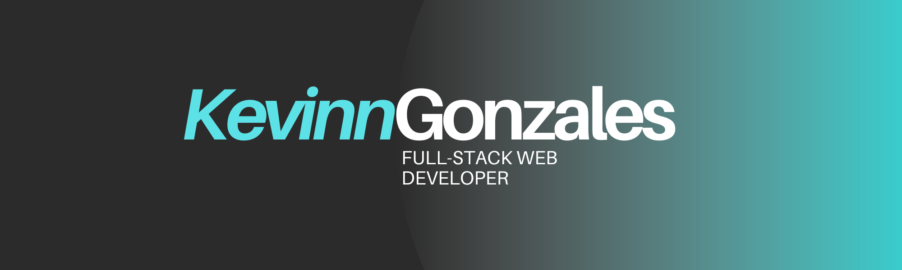

<h1 align="center"> Hello👋 </h1>

 
 

 
 

<h2 align="center">About Me 🏃🏻</h2>

 My name is Kevinn Gonzales and I am based in the Los Angeles area. I have always been passionate about computers and technology and I decided that a career in this space is something I can see myself doing long-term. I started my journey in the tech space during the summer of 2023 through The Knowledge House Fellowship. Although, I am fairly new to this space, I am absolutely thrilled and excited to commit myself and focus these skills into a career where I'm excited to make a meaningful impact in the digital world. 

 
 

<h2 align="center">Mission 🚀</h2>

 Having a good amount of experience in the customer-service space, I believe that I have exceptional interpersonal skills and customer satisfaction is a top priority for me. Additionally, with a keen eye for design and detail, I strive to create uniqe applications/websites that embody the vision and values for clients and companies. 

 
 

<h2 align="center">Languages and Technologies 🧑🏻‍💻️</h2>

 

 HTML  

 

 CSS  
  

 
  

 JavaScript  
  

 
  

 React.js  
  

 
  

 MongoDB  

 
 

<h2 align="center">Certifications 📃</h2> 

<ul align="center"> 
  <li>(In Progress) The Knowledge House Web Development Fellowship:
12-month job training program that prepares participants for the competitive tech industry. Learned industry tools that power popular apps, from creating beautiful, fast, and responsive interfaces with Meta’s ReactJS to creating powerful APIs with the Express framework.
</li>
</ul>

